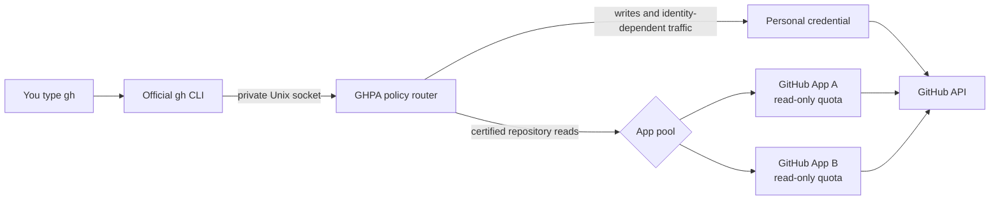

# GHPA

### More GitHub API headroom. Same `gh` CLI.

[](https://www.npmjs.com/package/@franciscomoretti/ghpa)
[](https://github.com/FranciscoMoretti/GitHubProxyAPI/actions/workflows/ci.yml)
[](https://nodejs.org/)
[](LICENSE)

GHPA is a local proxy that gives eligible GitHub reads access to the independent
rate-limit budgets of your GitHub Apps. Keep using the official `gh` commands,
flags, formatting, extensions, and authentication you already know. GHPA changes
the credential behind safe requests; it does not reimplement the CLI.

```console
$ ghpa rate-limit
CREDENTIAL  TYPE      ACCESS             RESOURCE  AVAILABLE  PERMISSIONS
gh          personal  personal (writes)  core      5000/5000  —
cli-a       app       read-only          core      4988/5000  actions,contents,issues,pull_requests
cli-b       app       read-only          core      4990/5000  actions,contents,issues,pull_requests
```

## Why GHPA?

A personal GitHub credential has one API budget. Creating more tokens for the
same account does not create more capacity. GitHub App installations have their
own budgets, but using them normally means managing tokens and changing the way
you call GitHub.

GHPA puts those budgets behind the CLI you already use:

- **Keep every `gh` command and option.** `gh` remains the program handling your
  requests, output, pagination, prompts, and extensions.
- **Use independent App quotas for certified reads.** GHPA mints scoped
  installation tokens, refreshes them automatically, and selects an available
  App for each eligible request.
- **Keep your identity for writes.** Mutations, user-dependent queries, and
  anything GHPA cannot classify safely retain the personal credential.
- **See where traffic went.** Inspect quota, route, fallback, and health data
  without exposing tokens or private keys.

## How it works



GHPA listens on a private Unix socket supported by `gh`. Before substituting an
App credential, it verifies that the caller can access the repository, matches
the repository's stable ID, checks the required permission, and requests an
installation token scoped to that repository and permission. If the request is
not on the explicit allowlist, it stays personal.

## Quick start

GHPA supports macOS and Linux. It requires Node.js 22 or newer and an
authenticated [GitHub CLI](https://cli.github.com/).

```sh
npm install --global @franciscomoretti/ghpa
gh auth status
ghpa init
```

You will need at least one GitHub App with a downloaded private key and an
installation on the repositories you want it to read. The next section walks
through that setup. Once an App is configured:

```sh
ghpa enroll-caller
ghpa start
ghpa doctor

# Try one command through the proxy without changing global gh configuration.
ghpa exec -- gh api repos/OWNER/REPO/git/trees/FULL_TREE_SHA

# Make the proxy transparent for normal gh use.
ghpa enable-gh
ghpa rate-limit
```

From this point, keep using `gh` normally. Use `ghpa` only to configure and
inspect the proxy.

## Configure a GitHub App

Create a GitHub App in **Settings → Developer settings → GitHub Apps**. Install
it only on the repositories that should use its quota. Start with repository
permissions set to **Read-only** for the workloads you intend to route:

- Contents
- Pull requests
- Issues
- Actions

Metadata read access is added by GitHub. Checks and commit statuses can also be
read-only on the App registration, though the current request allowlist does not
route those endpoint families yet.

Generate a private key and store the downloaded PEM outside this repository:

```sh
mkdir -p ~/.config/githubproxyapi/keys
mv ~/Downloads/your-app.pem ~/.config/githubproxyapi/keys/reader-a.pem
chmod 600 ~/.config/githubproxyapi/keys/reader-a.pem
```

Discover the installation ID without printing a token:

```sh
ghpa apps discover \
  --app-id APP_ID \
  --key-file ~/.config/githubproxyapi/keys/reader-a.pem
```

Get the repository's stable numeric ID with your normal identity, then add the
App to GHPA:

```sh
REPOSITORY_ID=$(gh api repos/OWNER/REPO --jq .id)

ghpa apps add \
  --name reader-a \
  --app-id APP_ID \
  --installation-id INSTALLATION_ID \
  --key-file ~/.config/githubproxyapi/keys/reader-a.pem \
  --repo OWNER/REPO:$REPOSITORY_ID \
  --permission contents \
  --permission pull_requests \
  --permission issues \
  --permission actions
```

Repeat `apps add` with another App installation to add another independent
budget. Restart GHPA after changing its configuration:

```sh
ghpa stop
ghpa start
ghpa doctor
```

## Use GHPA

### Check available quota

```sh
ghpa rate-limit
ghpa rate-limit --json
```

GitHub CLI exposes personal quota data through `gh api rate_limit`; it has no
dedicated rate-limit command. GHPA uses that endpoint for the current personal
values and combines it with the latest rate-limit headers observed from every
App. `ghpa quotas` is an alias.

The access column describes routing policy: `gh` is the personal identity used
for writes, while configured Apps are read-only. An App quota shows `unknown`
until that installation has produced a GitHub response.

### Inspect routing

```sh
ghpa status
```

`routes` counts requests handled by each App and by the personal credential.
`reasons` explains why requests were offloaded or kept personal. Status output
contains aliases, budgets, resets, and counts; it never includes raw tokens,
private keys, request bodies, or response bodies.

### Scoped and transparent modes

Use scoped mode while evaluating GHPA:

```sh
ghpa exec -- gh pr view 123 --repo OWNER/REPO
```

Enable transparent mode when you are ready:

```sh
ghpa enable-gh
gh pr view 123 --repo OWNER/REPO
```

`enable-gh` preserves the previous `http_unix_socket` setting and unrelated
`gh` configuration. To restore the previous transport safely:

```sh
ghpa disable-gh
ghpa stop
```

If GHPA is stopped while transparent mode remains enabled, `gh` cannot reach
GitHub. Run `ghpa start`, or disable the integration with the commands above.

## Routing policy

GHPA defaults to the personal credential and substitutes an App only for request
shapes whose meaning is known and tested.

| Request | Route | Required App permission |
| --- | --- | --- |
| Git blob by full SHA | App candidate | Contents: read |
| Git tree by full SHA, optionally `recursive=1` | App candidate | Contents: read |
| Pull-request files with numeric pagination | App candidate | Pull requests: read |
| Single-repository GraphQL PR scalar query | App candidate | Pull requests: read |
| Single-repository GraphQL issue scalar query | App candidate | Issues: read |
| Writes and GraphQL mutations | Personal | — |
| Viewer fields, search, connections, repository metadata | Personal | — |
| Unknown routes, fields, arguments, media types, or API versions | Personal | — |
| Conditional and range requests | Personal | — |

Default `gh pr list`, `gh pr view`, and `gh pr checks` queries may contain
viewer-relative fields or connections and therefore remain personal. A command
succeeding through the socket does not necessarily mean its quota was offloaded;
use `ghpa status` to verify the route.

This conservative policy avoids changing authorship, visibility, or
viewer-dependent results. The allowlist can grow as additional request shapes
gain fixtures and identity-equivalence tests.

## Safety model

- App tokens are scoped to configured repository IDs and read permissions.
- Only explicitly enrolled personal credentials may use the App pool. GHPA
  stores a SHA-256 fingerprint, never the personal token.
- Writes are never substituted, retried, or replayed by the App pool.
- Caller access is checked live and cached for no more than 60 seconds.
- Primary exhaustion can retry one certified read on another App.
- Secondary throttling pauses the entire pool instead of rotating identities to
  evade GitHub's protection.
- App tokens stay in memory. Configuration, state, logs, and key files use
  user-only filesystem permissions.
- Redirects and download hosts are constrained so App credentials cannot cross
  to an unapproved destination.

## Commands

| Command | Purpose |
| --- | --- |
| `ghpa init` | Create a private configuration file |
| `ghpa apps discover …` | List installations available to an App |
| `ghpa apps add …` | Add a scoped App installation |
| `ghpa apps list` | Show configured Apps without secrets |
| `ghpa enroll-caller` | Enroll the active `gh` credential by fingerprint |
| `ghpa start` / `ghpa stop` | Start or stop the local daemon |
| `ghpa doctor` | Validate keys, configuration, caller, and daemon health |
| `ghpa rate-limit` | Show personal and App budgets and access modes |
| `ghpa status` | Show raw health, routing, and scheduler data |
| `ghpa exec -- gh …` | Proxy one `gh` invocation |
| `ghpa enable-gh` | Persist transparent `gh` integration |
| `ghpa disable-gh` | Restore the previous `gh` socket setting |

Configuration lives at `~/.config/githubproxyapi/config.json`. Set
`GITHUBPROXYAPI_CONFIG` to use another absolute path. The longer
`githubproxyapi` executable remains available as a compatibility alias.

## Operational boundaries

- GHPA is currently a single-user local daemon. It does not register a login
  service; run `ghpa start` after reboot.
- Git clone, fetch, and push subprocesses do not use this API socket. Extensions
  with independent HTTP clients may also bypass it.
- Windows sockets, GitHub Enterprise/custom API hosts, arbitrary GraphQL
  rewriting, response caching, and a hosted gateway are not supported yet.
- Approved download origins are constrained to GitHub-operated hosts. WebSocket
  and `CONNECT` traffic are unsupported.
- The default concurrency is 8 and the request timeout is 30 seconds. Large
  uploads may require a higher configured timeout.

## Development

```sh
git clone https://github.com/FranciscoMoretti/GitHubProxyAPI.git
cd GitHubProxyAPI
npm ci
npm run check
npm link
```

The test suite uses generated RSA keys, fake clocks and local GitHub upstreams.
It also runs the real `gh` executable against fixtures to cover REST, GraphQL,
pagination, binary bodies, API errors, credential refresh, access checks,
failover, throttling, streaming, socket ownership, lifecycle, and reversible
configuration.

- [Implementation plan](docs/implementation-plan.md)
- [Live validation](docs/live-validation.md)
- [Existing-project assessment](docs/proxy-value-notes.md)
- [Naming research](docs/name-research.md)

## Acknowledgements

GHPA is an independent TypeScript implementation informed by
[bored-engineer/github-api-proxy](https://github.com/bored-engineer/github-api-proxy),
[github-rate-limit-http-transport](https://github.com/bored-engineer/github-rate-limit-http-transport),
and [github-auth-http-transport](https://github.com/bored-engineer/github-auth-http-transport).
Their approaches to credential pools, Unix listeners, installation-token
sources, and quota-aware selection shaped parts of this design. GHPA adds
caller-access verification, request-level routing, preserved personal writes,
and reversible integration with the official CLI.

See [THIRD_PARTY_NOTICES.md](THIRD_PARTY_NOTICES.md) for pinned upstream
references and license notices.

## License

[MIT](LICENSE) © 2026 GHPA contributors
