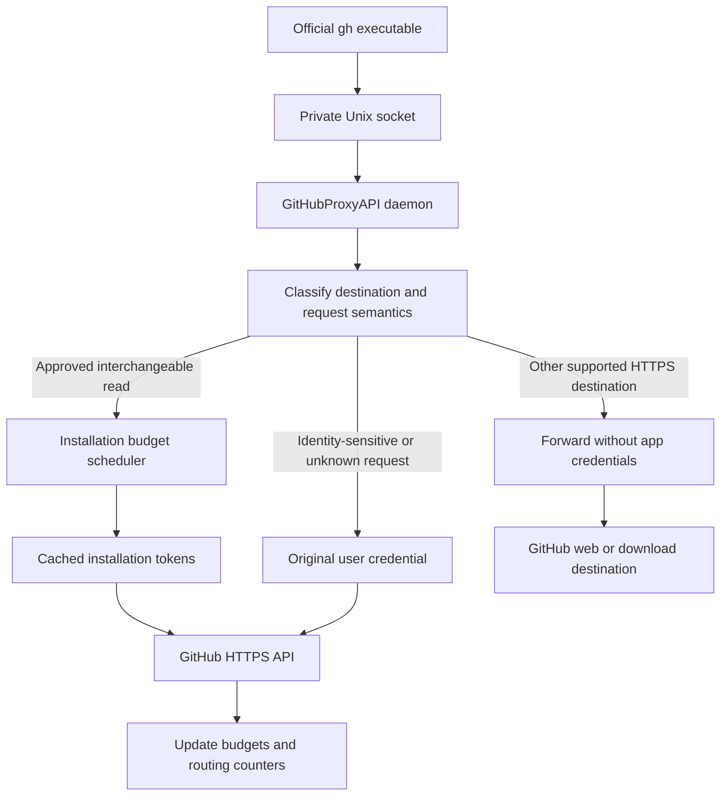

# GitHubProxyAPI implementation and test plan

Status: initial TypeScript implementation complete; offline validation passes. Live App parity and actual workload capacity remain unverified. Updated 2026-09-12.

The implementation supersedes earlier Go stack proposals. See README for the exact supported routing surface and runnable commands. Broader workflow coverage below remains a roadmap, not a claim of implementation.

## Outcome

Keep the installed, official `gh` executable and its commands, flags, aliases, formatting, prompts, and exit behavior. A local TypeScript/Node.js daemon receives its HTTP requests through `http_unix_socket` and routes verified, interchangeable reads across the user's GitHub App installations. Requests that need the user's identity retain the original user credential.

This is a single-user, macOS-first tool. The routing implementation should also run on Linux. A hosted endpoint, Windows transport, multi-user access, browser dashboard, and Git credential proxy are later work.

Two separate acceptance criteria define success:

1. **Compatibility:** the tested workflows behave the same through the proxy.
2. **Capacity:** a representative workload consumes less of the personal rate-limit budget because useful work is served by at least two independent installations.

Compatibility alone does not prove useful extra capacity. We will measure the eligible proportion of the user's actual workload before enabling this globally.

## Verified facts and remaining inputs

- Installed CLI: `gh version 2.100.0 (2026-09-03)` at `/Users/fran/bin/gh`.
- Current repo started with a README; there is no application implementation yet.
- `python3 scripts/probe_gh_transport.py` passed four checks against a local fake API: REST with `--jq`, GraphQL POST, pagination following an absolute GitHub URL, and the CLI's nonzero exit on an API error. All five received requests retained `Host: api.github.com` and used a dummy credential.
- The probe uses temporary config/cache/state/data directories, blocks ordinary HTTP proxy egress, and does not read or change the user's gh authentication or config. This is transport evidence, not validation of all built-in commands or live GitHub access.
- `http_unix_socket` is a global transport setting. It can also capture downloads and other HTTP calls made with gh's shared clients. It is not limited to `api.github.com`. [gh configuration](https://cli.github.com/manual/gh_config), [transport research](research/gh-transport.md).
- App installation tokens provide installation budgets; personal tokens and app user tokens share the user's budget. Minting another token for an existing installation does not create another budget. [GitHub REST limits](https://docs.github.com/en/rest/using-the-rest-api/rate-limits-for-the-rest-api).
- A read can depend on the caller. For example, GraphQL `Repository.viewerPermission` returns null for a GitHub App, and gh uses viewer-related fields. Treating every GET or GraphQL query as interchangeable would change behavior. [Credential-routing research](research/credential-routing.md).

Inputs for live work: the user's most frequent/rate-limited commands, the account and repository they target, two existing app registrations if suitable, and the local paths to their private keys. Default decision pending user preference: all writes retain personal identity. No real keys are needed for the first implementation slice.

## Architecture



Build around a few deep modules with tests crossing their normal interfaces:

| Module | Small interface | Behavior kept inside |
| --- | --- | --- |
| Proxy | Node HTTP handler plus listener lifecycle | HTTP fidelity, streaming, cancellation, destination validation, forwarding, error responses |
| Routing policy | Request and caller context → routing decision with reason | Reviewed REST rules, GraphQL parsing, identity and access requirements, conservative fallback |
| Credentials | Installation + requested scope → usable token | RSA JWT signing, token exchange, expiry, refresh coordination, credential health |
| Budget scheduler | Eligible candidates + resource + cost → reservation | Shared budget identities, availability, concurrency, cooldowns, response reconciliation |
| Local configuration/control | Validate, serve, inspect, enable, disable | Key references, app metadata, socket config, diagnostics and restoration |

Use Node's standard HTTP streaming facilities. Use a maintained GraphQL parser for semantic inspection instead of regexes. Inject an upstream transport and clock for deterministic tests. Add interfaces where there are real alternatives: live versus fake HTTP and real versus fake time. Avoid building a generic provider framework.

The implementation uses Node.js 22+, TypeScript, graphql and yaml; dependency versions are locked in package-lock.json. Python is only used for the standalone compatibility probe.

## Authentication and routing contract

1. In normal use, gh continues to obtain its personal/OAuth/PAT credential exactly as it does today. The daemon forwards that credential on personal requests; a second stored copy is unnecessary.
2. App substitution is enabled only for the explicitly configured account/caller and reviewed repository access. Bind eligibility to the actual credential and approved access, not merely a matching username. A different account, explicit Authorization override, or narrower token does not inherit app access automatically.
3. Verify that the original caller and installation can both access the reviewed resource. Enrollment binds a credential fingerprint, account ID, stable repository ID and reviewed capability checks; a successful `/user` call alone is insufficient. Cache successful authorization evidence for at most 60 seconds initially, revalidate through the original credential, and invalidate immediately on observed auth/access failures or config changes. Expired evidence disables app substitution until revalidation succeeds. Revocation between checks creates a bounded window of up to that TTL; immediate revocation parity would require checking each request and reduce the gain. Measure validation overhead and include narrower PATs, repository transfers and revoked grants in tests.
4. A REST route is eligible only when its method, path, query parameters, API version, representation, permission needs, and response semantics have been reviewed. Examples to evaluate first: PR file lists, commit lists, and selected Actions reads. A `/repos/*` wildcard is not sufficient; repository metadata can itself contain caller-dependent fields.
5. Unknown REST requests and all writes use the original credential. Preserve explicit `Authorization`, API version, media type and request body semantics through the personal path.
6. Initially, GraphQL passes through personally. Add an AST-based allowlist after collecting representative shapes. Evaluate the selected operation, aliases, fragments, directives and resolved repository variables. Approve the complete selection tree, field paths, arguments and defaults, not just field names. For example, `forks(affiliations: [OWNER])` depends on the viewer without selecting a `viewer*` field. Every selected field and repository must be approved. Mutations, viewer-dependent fields, broad search, unknown fields, and ambiguous/oversized inputs stay personal. Do not split or rewrite queries in version 1.
7. Never assume a request is safe to balance merely because it does not mutate data. Notifications, `/user`, permission views, cross-repository search and user-specific collections remain personal until independently proven equivalent.
8. Maintain visibility consistency through pagination and conditional requests. Candidates must have equivalent reviewed access and proven cursor/ETag portability; otherwise keep those variants personal or retain established credential affinity. Do not mix an ETag obtained personally with an app response or assume a cursor is portable. Query shape/schema changes default to personal routing and are visible in diagnostics.
9. Do not rotate on arbitrary 401/403/404 errors. Invalidate expired credentials appropriately; revoke eligibility when access changes. A bounded retry/fallback for an approved read requires a classified failure. Writes and GraphQL mutations are never replayed automatically after an uncertain result.

This policy evolves at the HTTP/GraphQL request level. It does not parse or reimplement gh CLI commands and flags.

## HTTP compatibility and local operation

- Bind the Unix socket inside a directory accessible only to the current user (directory 0700, socket 0600). Detect an existing live daemon before removing a stale socket. Never delete an unrelated file at the requested path.
- Start with an isolated gh config for testing. Configuration isolation does not isolate the OS keyring, so use dummy credentials offline and avoid auth-mutating commands in the test harness.
- For normal operation, `enable-gh` records the previous socket setting and changes only that setting after checking daemon health. `disable-gh` restores the prior value, including a previously configured socket, without overwriting later unrelated config edits.
- Keep canonical `github.com` identity and repository remotes. Do not change `GH_HOST` to a pretend Enterprise host.
- Preserve request paths/queries, streaming bodies, content negotiation, binary downloads, response status, `Link`, `Location`, ETag, rate-limit headers, and cancellation. Strip hop-by-hop headers as required by HTTP. Do not report the combined pool budget as if it were GitHub's selected credential budget.
- Classify non-API hosts explicitly. Never inject app credentials into OAuth/web requests, upload/download redirects, third-party URLs or other GitHub hosts. Honor credential stripping on cross-host redirects. All destination resolution must reject unintended loopback/private-network forwarding and self-proxy loops.
- The Unix transport does not reliably convey the original URL scheme. Support normal GitHub HTTPS destinations first. Arbitrary `gh api http://...` and custom external hosts require an explicit destination mapping or documented direct mode, rather than silently changing their semantics.
- Investigate uploads, archive/log/artifact downloads, Enterprise hosts and browser/auth flows separately. Git subprocesses and extensions with their own networking can bypass the socket. Preserve their existing behavior and report which paths are outside quota pooling.
- If the daemon is down after global enablement, gh's socket connections will fail. Show a clear recovery command and provide `githubproxyapi exec -- gh ...` for scoped trials plus `disable-gh` for restoration. Do not promise automatic fallback after an unavailable socket: unmodified gh does not supply it.
- A stopped/restarted daemon must retain known reset/cooldown deadlines. Persist minimal non-secret budget state atomically; installation tokens stay in memory and are reminted after restart. Limit the initial release to one daemon per local account to avoid competing schedulers.

Proposed commands (not implemented yet):

```text
githubproxyapi config validate
githubproxyapi apps import --name NAME --app-id ID --key-file PATH
githubproxyapi apps discover
githubproxyapi serve
githubproxyapi exec -- gh pr list --repo OWNER/REPO
githubproxyapi status
githubproxyapi doctor
githubproxyapi enable-gh
githubproxyapi disable-gh
```

The `exec` command forwards arguments without interpreting gh options. Test that its environment overlay retains the user's aliases, extensions, active account, and formatting preferences. It is a trial/recovery facility, not a replacement command tree.

## Budgets and scheduling

- Account for `(GitHub host, budget owner, resource)`. User credentials for the same account share user budgets; every app installation has its own budgets. Group duplicate credentials for an installation. Keep REST core/search/code-search and GraphQL separate.
- Prefer eligible installations and distribute work by available budget with fair tie-breaking. Reserve capacity before dispatch and reconcile from GitHub response headers; subtract in-flight reservations and handle out-of-order responses conservatively.
- Do not hardcode a universal 5,000 limit or equate GraphQL cost with one REST request. Unknown budgets/costs get cautious probes. Track GraphQL response cost/errors as well as headers where available.
- On a confirmed primary exhaustion, mark that budget unavailable until its reset. Another independently eligible budget can serve subsequent work; bounded retries are allowed only for verified replay-safe reads.
- On secondary throttling or ambiguous throttling, honor `Retry-After`/reset guidance and apply a conservative shared cooldown with backoff. Do not evade it by rotating installations. Use a shared concurrency limit across REST, GraphQL, minting and validation traffic; keep default concurrency low.
- If apps are unavailable, use personal capacity only when the policy permits and capacity remains. If all eligible budgets are unavailable, return a bounded wait/error with retry timing rather than spin or hang indefinitely. Status must explain the exhausted resource.
- Handle GraphQL errors returned with HTTP 200; a successful transport status does not imply the operation succeeded. Never discard partial data and silently substitute another identity.
- Separate diagnostics from command output. Record credential aliases, routing reasons, resource, cost/remaining/reset, upstream request ID, latency and error category. Do not log tokens, Authorization, private keys, bodies or private query values by default. Distinguish observations made by this daemon from other account traffic.

## Reusing and setting up GitHub Apps

Browser setup is part of the implementation workflow after the local proxy and fixtures work. Use the user's authenticated browser to inspect their existing app registrations and installations; account login, 2FA or sudo-mode reauthentication may require the user.

For each of two suitable existing apps, inventory only its name, app/client ID, installation ID, installation owner, repository selection and granted permissions. Reuse a local downloaded PEM by path. GitHub does not let us download an existing private key again: if the PEM is unavailable, generate an additional key and leave existing keys intact. Store it outside the repo in a user-only configuration directory. Do not paste key material into chat, logs, config examples or commits.

Start with both apps installed on the same designated test repository. Request repository read access only for the tested workload: Metadata plus Contents, Issues, Pull requests and Actions as needed; Checks/Commit statuses only for checks-related tests. Existing apps may have other consumers or broader permissions. Avoid changing their existing registration grants unnecessarily; scope minted tokens down to the chosen repository and read permissions where supported.

The daemon signs a short-lived app JWT, discovers the appropriate installation, and exchanges it for an installation token. Refresh before expiry with one refresh in flight per scope, handle clock skew, and treat tokens as opaque variable-length strings. Cache and budget identities remain separate: multiple scoped tokens can still share one installation quota.

Use a designated existing test repo if available. Creating a dedicated private fixture repo is an optional later step to agree with the user. Live writes, PR creation, comments, labels and cleanup require a concrete agreed test scope; the current phase plans and probes locally. [Detailed onboarding procedure](research/app-onboarding.md).

## Delivery sequence and exit checks

| Slice | Deliverable | Exit check |
| --- | --- | --- |
| 0 — transport proof | Reproducible dummy-token Unix-socket probe | **Passed locally:** REST, GraphQL, pagination, API error exit |
| 1 — personal pass-through | TypeScript daemon, private socket, scoped runner, fake upstream, original-credential forwarding, opt-in sanitized workload-shape capture | Built-in gh commands and transport edge cases match direct fake-upstream fixtures; real config untouched; workload sample guides first routes and app permissions |
| 2 — app credentials | Validated key references, JWT exchange, discovery, scoped tokens, refresh and status | Offline lifecycle/race tests pass; two existing apps can authenticate to the chosen repo with a small live read budget |
| 3 — REST pooling | Reviewed route rules, budget scheduler, personal fallback, throttling | Forced fake exhaustion switches independent installations; identity/permissions and writes remain personal |
| 4 — gh workflow coverage | Captured representative request shapes, GraphQL allowlist, regression fixtures | User-selected commands compare correctly across personal and pooled modes; eligible requests reduce personal usage |
| 5 — normal-use setup | Enable/disable restoration, service lifecycle, doctor, documentation and release packaging | Can enable, restart, recover from daemon failure, and restore prior gh config; agreed soak workload is stable |

Keep each slice runnable. In slice 1, record opt-in operation structure, field paths and routing-relevant parameter names while redacting literals, variables, credentials and response bodies. Use the sample to estimate potential offload and choose the smallest useful REST/GraphQL scope before onboarding apps. Do not spend time on a dashboard or broad app creation before slices 1–3 work. Slice 4 is required before claiming this solves the user's actual quota problem; a mostly GraphQL workload may benefit little from REST-only pooling.

## Test strategy

### Offline behavior tests (required for development/CI)

Use a fake GitHub HTTP server, generated disposable RSA keys, an injectable clock, and actual gh subprocesses. No live credentials in CI. Pin gh 2.100.0 initially, then test the oldest explicitly supported release and a current release in the compatibility matrix.

| Area | Essential cases |
| --- | --- |
| HTTP fidelity | REST/GraphQL, absolute pagination, redirects, upload/download bodies, gzip, binary/large responses, ETag/304, cancellation, headers, malformed requests |
| Credential lifecycle | JWT validity/signature/skew, expiry refresh, concurrent refresh, failed exchange, revoked key/token, different scoped tokens sharing one budget, opaque long tokens |
| Routing/access | Unknown route stays personal; writes retain author; repository metadata/viewer fields; unauthorized repo/narrow PAT; multiple accounts; expired authorization evidence/revocation window; repository transfers; changed installation grants; media type/version/parameter variants; cursor and ETag/304 principal switching |
| GraphQL | Aliases/fragments/directives, operation selection, multiple repos, variables/defaults, viewer fields nested anywhere, viewer-relative arguments such as affiliations, queries vs mutations, parse failures, partial data, HTTP-200 errors and variable cost |
| Scheduling | Separate core/search/GraphQL; same-account PAT grouping; fair selection; reset boundaries; in-flight accounting; out-of-order headers; single/no available installation; external usage |
| Failure behavior | Primary exhaustion, secondary 403/429 with positive remaining, Retry-After formats, cooldown restart, 401/403/404 without quota errors, safe retry bounds, no write replay, upstream failure |
| Confidentiality | No app tokens cross hosts; no secrets in errors/status/logs; redirects cannot turn into credential leaks; unsupported/private destinations and self-loops rejected |
| Lifecycle | Existing socket, stale socket, unrelated file, startup failure, shutdown, one daemon, enable/disable preserving config, retained cooldowns, direct recovery |

Run TypeScript checking, the Node test suite (including concurrent refresh/reservation cases), and the production build. Use tests that assert visible behavior through the proxy, rather than reproducing internal calculations.

### Actual gh command coverage

Prioritize the user's examples once provided. Initial candidates:

- `gh api`: GET/POST, `--paginate`, `--jq`, `--template`, custom headers, absolute URLs, GraphQL operations and errors.
- `gh pr list/view/diff/checks`: default output and selected `--json` fields; include viewer-dependent variants.
- `gh issue list/view`, `gh repo view`, `gh run list/view`, and representative artifact/log downloads.
- Personal identity checks and account switching; permission-dependent commands must behave as the same user.
- Fake-only write scenarios for PR/issue creation and mutations; assert original actor and at-most-once dispatch under failure.
- Auth, extension and Git smoke tests that establish which network paths use the socket. Document unsupported custom schemes/hosts rather than claiming universal interception.

Compare deterministic exit status, parsed JSON and stable stdout/stderr. Use PTY tests for selected interactive cases and shell completion/aliases only where integration could affect them. Do not normalize away authorship, permissions, viewer fields, missing objects or pagination differences.

### Live validation (small, read-only first)

1. Confirm account, test repository and two installations with matching reviewed access. Authenticate using local key files and the existing personal credential without printing them.
2. Record each observed resource budget and installation identity. Use ordinary response headers and a few deliberate rate-limit reads; do not continually poll `/rate_limit`.
3. Run the chosen stable read cases personally and through each app/proxy mode. Check content, visibility, pagination and exit behavior. Account for concurrent repository changes explicitly; do not dismiss unexplained differences.
4. Run a short representative mixed workload through the proxy. Report requests served by app A, app B and the personal credential, fallback reasons, latency, and personal-budget usage. Flag traffic outside the daemon as a measurement confounder.
5. Demonstrate exhaustion behavior with the fake upstream or a local low-budget test adapter. **Do not burn through thousands of GitHub requests to force real exhaustion.** Keep an initial configurable cap of 60 live upstream requests, including discovery/token/validation overhead; stop and report incomplete cases at the cap.
6. Only after agreeing a specific disposable write test, create/update a test item to verify personal authorship and at-most-once behavior. Track created IDs for agreed cleanup. Read-only validation can otherwise complete independently.

Before global enablement, provide a report: commands checked, results, supported versions, unsupported paths, observed offload share, latency overhead, and exact recovery procedure. Pick an acceptable offload target from the user's actual workload; do not invent a guaranteed multiplier.

## Decisions to revisit after measurement

- If most expensive requests are viewer-sensitive GraphQL, maintain behavior and report the limited gain. Query decomposition is a separate future design requiring additional semantic tests.
- Add credential-aware caching/conditional requests only after routing correctness; version 1 should avoid persistent response caches and cross-identity cache contamination.
- Add a hosted `api_host` transport only after local compatibility is established. It needs HTTPS deployment and separate client authentication and remains subject to gh's experimental support.
- Reassess existing proxy projects for reusable concepts or libraries, but preserve upstream gh instead of introducing a command-aware replacement. [Existing comparison notes](alternative-projects-notes.md).
